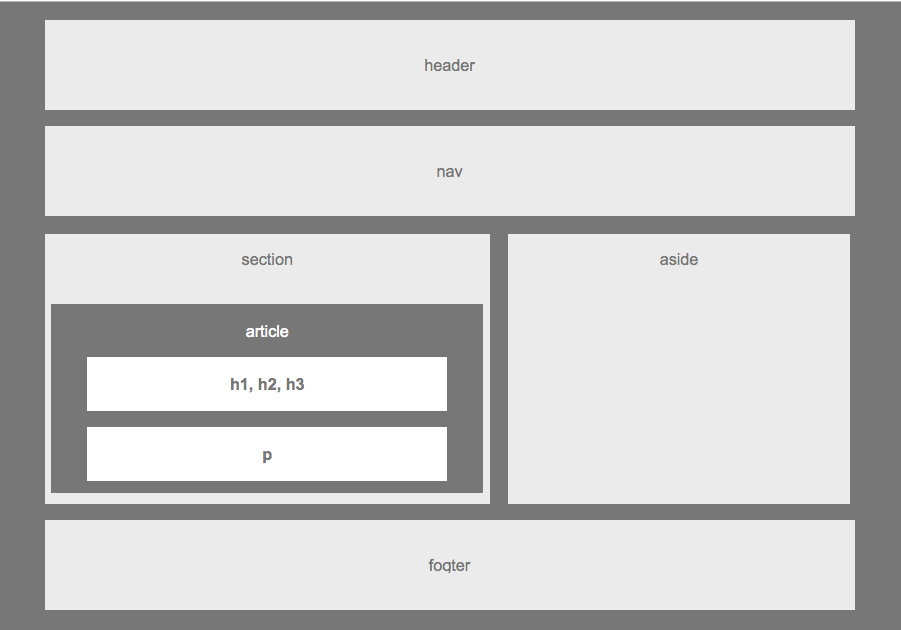

# Basic WireFrame README

## Project Description:

This repository holds html and css files, which combine to form the basic wireframe of a potential website. 

[Check out the deployed version here](https://greysongy.github.io/HW-Wireframe/)

### Technologies Used: 

html, css

